# ナイーブベイズ分類器
## 今回考える問題
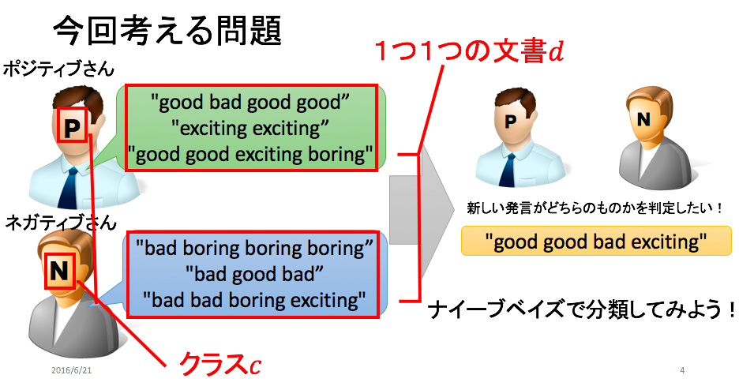

## ナイーブベイズ分類器

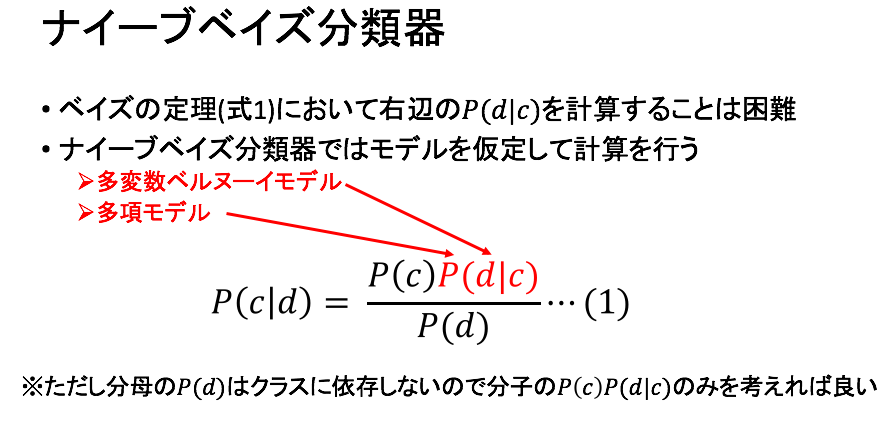

## 多変数ベルヌーイモデル
### 多変数ベルヌーイモデルの適用

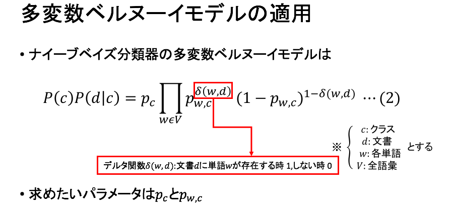

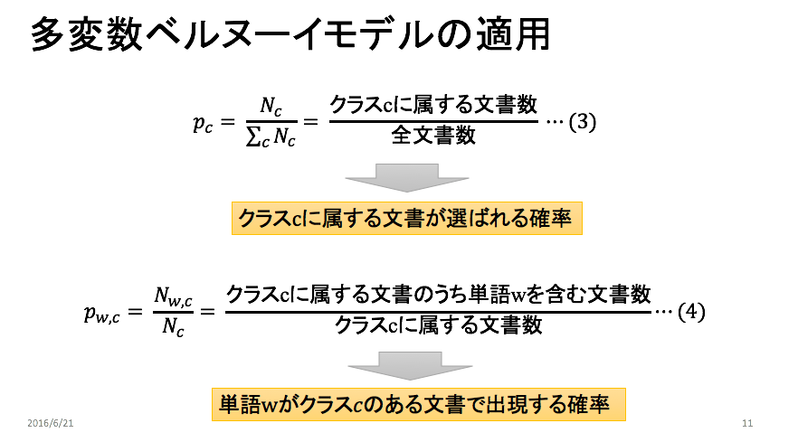

### 多変数ベルヌーイモデル***学習フェーズ***
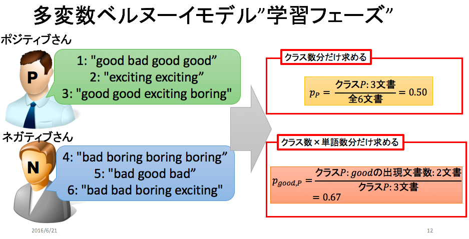

### 多変数ベルヌーイモデル***分類フェーズ***
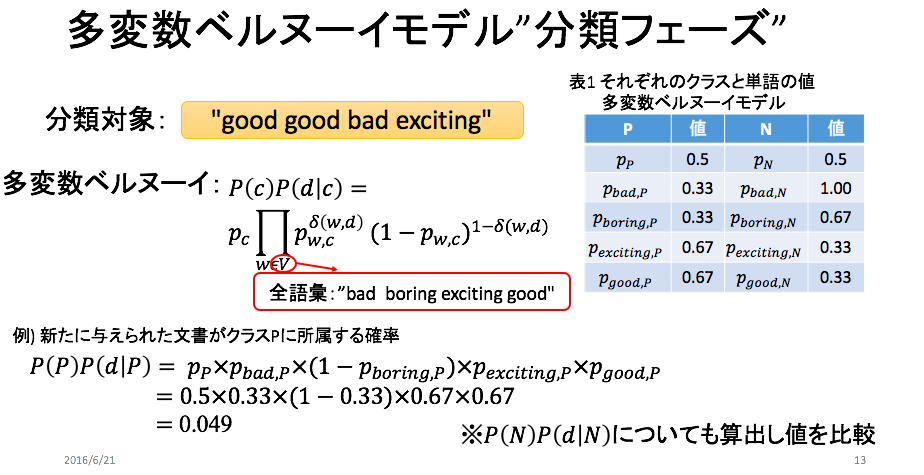

### 実装ナイーブベイズ***学習フェーズ***
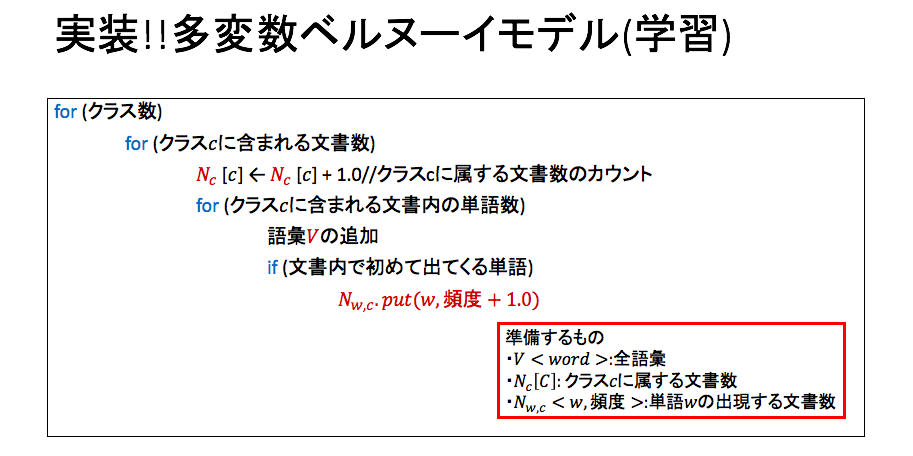

### 実装ナイーブベイズ***分類フェーズ***
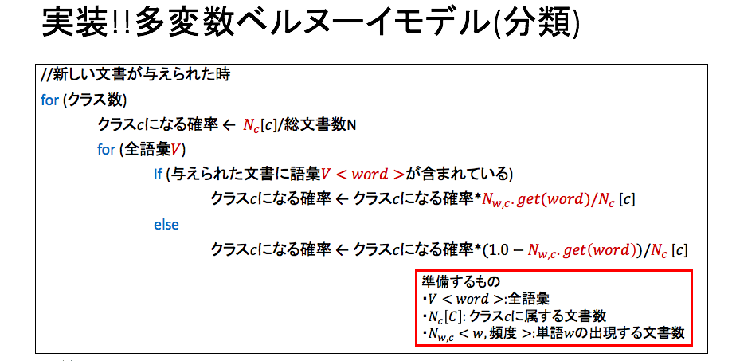

## 多項モデル
### 多項モデルの適用
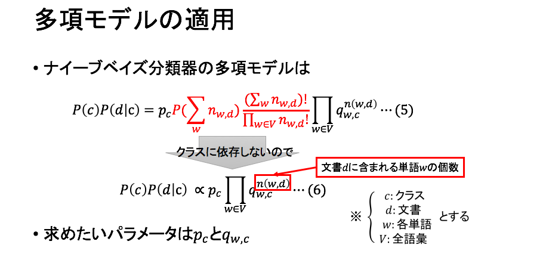

### 多項モデル***学習フェーズ***
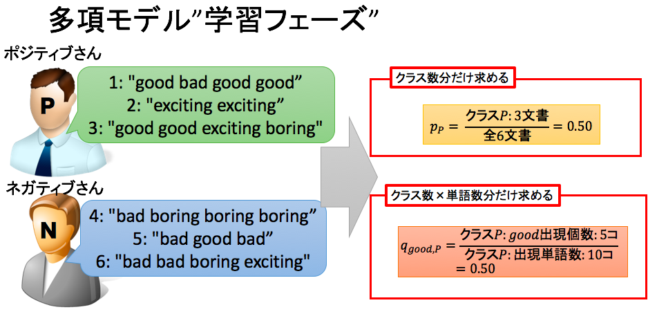

### 多項モデル***分類フェーズ***
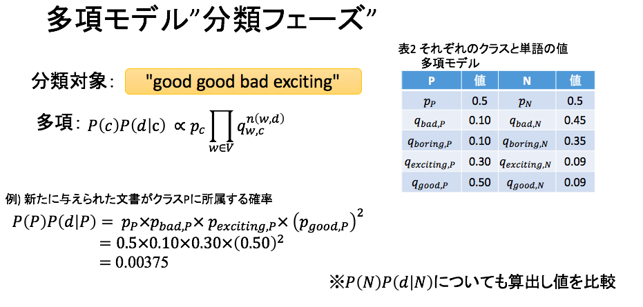

### 実装ナイーブベイズ***学習フェーズ***
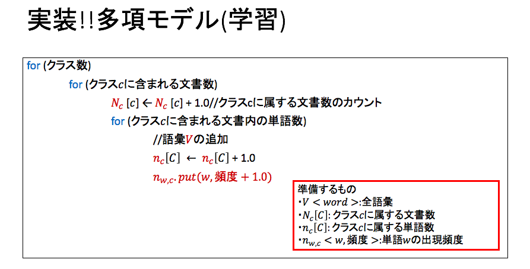

### 実装ナイーブベイズ***分類フェーズ***
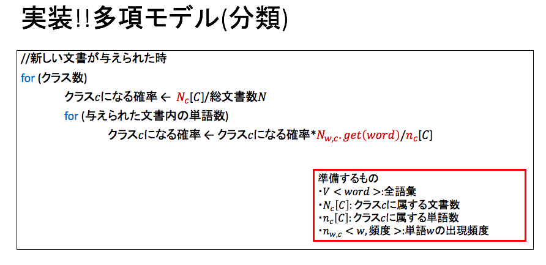

### 参考
* [発表資料](https://github.com/ichimunemasa/MachineLearning/blob/master/NaiveBayes/%E3%83%8A%E3%82%A4%E3%83%BC%E3%83%96%E3%83%99%E3%82%A4%E3%82%BA%E5%88%86%E9%A1%9E%E5%99%A8.pdf)
* [プログラム-ナイーブベイズ分類器](https://github.com/ichimunemasa/MachineLearning/tree/master/NaiveBayes/naive_bayes)
